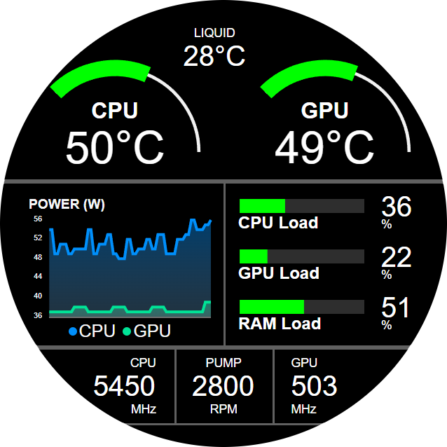

# NZXT Aviation Gauge

Aircraft Engine Indicating and Crew Alerting System (EICAS) inspired gauge using the NZXT web integrations API.

# Use in Kraken web integration

URL: https://reinhardtbotha.github.io/NZXT-aviation/

# How to run locally

install dependencies  
`npm install`  
run locally  
`npm run dev`

Local URL for NZXT CAM: http://localhost:5173/NZXT-aviation/

# Technologies used

- React
- Vite
- ApexCharts
- Styled Components

# Disclaimer

This integration was developed and tested on the Kraken Elite. Therefore, it may not function as expected on models with different screen sizes.
